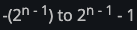
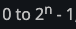

# Data Types
Rust has two data type subsets: **scalar** and **compound**.

## Scalar Types
A scalar type represents a single value.
* integer
* floating-point number
* Boolean
* character
<br><br>
---
### Integer Types
Length  | Signed | Unsigned
------- | ------ | --------
8-bit   |	i8     | u8
16-bit  | i16    | u16
32-bit  | i32    | u32
64-bit  | i64    | u64
128-bit | i128   | u128
arch    | isize  | usize
<br>
<ins>Signed</ins> － may be negative <br>
<ins>Unsigned</ins> － only positive numbers<br>
<ins>isize, usize</ins> － will store 64b bits on 64-bit architecture <br>
and 32 bits if you’re on a 32-bit architecture.<br><br>

Each variable may store numbers in range:
* signed <br>
 
* unsigned <br>
 

Example:
Length  | Signed          | Unsigned
------- | --------------- | --------
8-bit   |	-128 to 127     | 0 to 255
16-bit  | -32768 to 32767 | 0 to 65536
<br>


Note that all number literals except the byte literal allow a type suffix, such as `57u8`, and `_` as a visual separator, such as `1_000`.<br><br>

---
### Floating-Point Types
Rust has `f32` and `f64` (default) primitive types for floating-point numbers.

```rust
fn main() {
    let x = 2.0; // f64
    let y: f32 = 3.0; // f32
}
```
<br>

---
### Numeric Operations
```rust
fn main() {
    // addition
    let sum = 5 + 10;

    // subtraction
    let difference = 95.5 - 4.3;

    // multiplication
    let product = 4 * 30;

    // division
    let quotient = 56.7 / 32.2;

    // remainder
    let remainder = 43 % 5;
}
```
<br>

---
### The Boolean Type
```rust
fn main() {
    let t = true;

    let f: bool = false; // with explicit type annotation
}
```
<br>

---
### The Character Type
Rust’s char type is four bytes in size and represents a Unicode Scalar Value.<br>
Chinese, Japanese, and Korean characters; emoji; and zero-width spaces are all valid char values in Rust.
```rust
fn main() {
    let c = 'z';
    let z = 'ℤ';
    let heart_eyed_cat = '😻';
}
```
<br>

## Compound Types
Compound types can group multiple values into one type.<br> 
Rust has two primitive compound types: **tuples** and **arrays**.<br><br>

---
### The Tuple Type
Tuples have a fixed length.<br>
Each position in the tuple has a type, and the types of the different values in the tuple don’t have to be the same.

```rust
fn main() {
    let tup: (i32, f64, u8) = (500, 6.4, 1);
}
```

Destructure a tuple value:
```rust
fn main() {
    let tup = (500, 6.4, 1);

    let (x, y, z) = tup;

    println!("The value of y is: {}", y);
}
```

We can access a tuple element directly by using a period (.):
```rust
fn main() {
    let x: (i32, f64, u8) = (500, 6.4, 1);

    let five_hundred = x.0;

    let six_point_four = x.1;

    let one = x.2;
}
```
<br>

---
### The Array Type

Every element of an array must have the same type. <br>
Arrays have a fixed length.

```rust
let a: [i32; 5] = [1, 2, 3, 4, 5];
```

Array that contains the same value for each element
```rust
let a = [3; 5]; //[3, 3, 3, 3, 3]
```

```rust
let first = a[0];
let second = a[1];
```